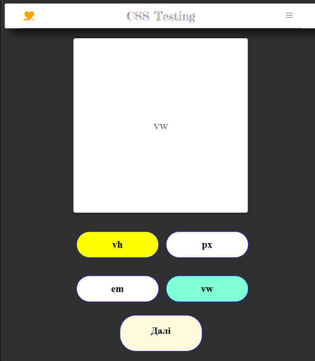
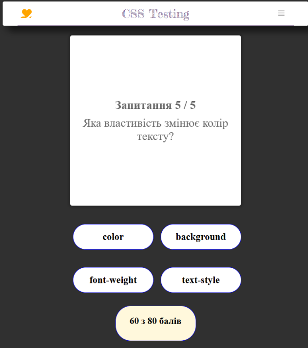

# 📱 Express Testing — Gamified Mobile Quiz Web Application Built with React

**Express Testing** is an interactive, game-style quiz web application designed specifically for mobile and tablet screens. The core purpose of this project is to provide a fast, fun, and efficient way to test web technology skills (CSS) while tracking score updates in real-time.

🚀 **Live Demo**: [View the project on GitHub Pages](https://OlehKuts.github.io/Express_testing)

---

## 📸 Demo (Screenshots)

To quickly visualize the gameplay and core functionality of the application, review the demonstration screenshots below:

|                Wrong Answer Visual                |                End of Quiz (Results)                |
| :-----------------------------------------------: | :-------------------------------------------------: |
|  |  |

---

## ✨ Features

- **Gamified Scoring System**: User scores update dynamically on the screen based on answer correctness, giving immediate performance feedback.
- **Intuitive Color Feedback**: Instant visual response upon selection — correct and incorrect answers are clearly highlighted with corresponding colors.
- **Mobile-First Design**: The interface, layout proportions, button sizing, and text lengths are tailored exclusively for modern smartphone displays.
- **Modern Architecture**: Built using React functional components combined with state hooks to manage complex quiz behavior.

---

## 🛠️ Tech Stack

- **Core Library**: React (Functional Components)
- **Responsiveness & Layout Control**: `react-responsive` (handling responsive rendering conditionally within React components)
- **Styling**: Pure CSS3 (optimized for a compact, mobile-friendly layout)
- **Package Manager**: npm
- **Deployment**: GitHub Pages

---

## ⚙️ Installation and Local Setup

To run this project locally on your machine and test it inside a mobile browser emulator:

1. **Clone the repository:**

   ```bash
   git clone https://github.com
   ```

2. **Navigate to the project directory:**

   ```bash
   cd Express_testing
   ```

3. **Install the dependencies:**

   ```bash
   npm install
   ```

4. **Start the development server:**
   ```bash
   npm start
   # or 'npm run dev' if the project is built with Vite
   ```

Once the application is running, open [http://localhost:3000](http://localhost:3000) in your browser and press **F12** to enable device emulation for mobile viewing.
